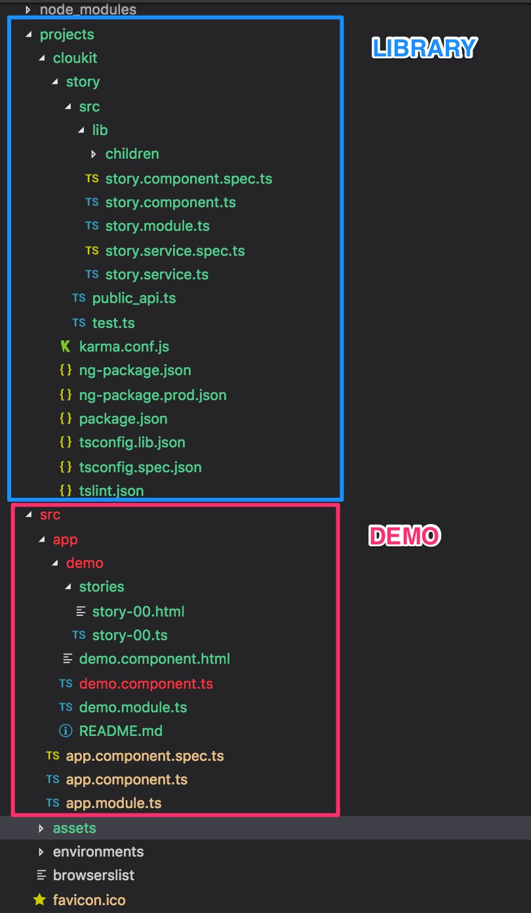

# Development

-----

&nbsp;

### Module Format

See: https://github.com/angular/angular-cli/wiki/stories-create-library

-----

&nbsp;

### Building a Library and Publishing to npmjs.com

E.g. for @cloukit/story

```bash
yarn
yarn pre
yarn build @cloukit/story --prod
cd dist/cloukit/story
npm publish
```

Now there will be a `./dist/cloukit/story/` directory containing everything that can now be published to npmjs.com

:bangbang: Publishing is done by `Jenkinsfile` via Jenkins on TAG-Job run.

Therefore tag your library like so

```bash
git tag -a 1.0.2 -m "1.0.2"
git push origin 1.0.2
```

-----

&nbsp;

### Setup for a Library (Migration of Angular5 to Angular6)

Previously up to Angular5 we used our own build chain.
Since 2018-05-11 and Angular 6 we use Angualr CLI that has support
for building libraries: https://github.com/angular/angular-cli/wiki/stories-create-library

(1) Create new project with Angular CLI v6

```
ng new story-demo --prefix cloukit --inline-style --inline-template
```

(2) Add `"private": true` to package.json (if not already there)

(3) replace `favicon.ico` with cloukit one

```
rm favicon.ico && wget https://cloukit.github.io/favicon.ico
```

(4) Change `app.component.ts` to

```
import { Component } from '@angular/core';

@Component({
  selector: 'cloukit-root',
  template: `<cloukit-demo></cloukit-demo>`,
  styles: []
})
export class AppComponent {
  title = '@cloukit/story demo';
}
```

(5) Change `app.component.spec.ts` to

```
import { TestBed, async } from '@angular/core/testing';
import { AppComponent } from './app.component';
describe('AppComponent', () => {
  beforeEach(async(() => {
    TestBed.configureTestingModule({
      declarations: [
        AppComponent
      ],
    }).compileComponents();
  }));
  it('should create the app', async(() => {
    const fixture = TestBed.createComponent(AppComponent);
    const app = fixture.debugElement.componentInstance;
    expect(app).toBeTruthy();
  }));
});
```

(6) Add `DemoModule` in `app.module.ts`

```
import { DemoModule } from './demo/demo.module';
...
imports: [
  BrowserModule,
  DemoModule
],
...
```

(7) Migrate the `demo` folder to `src/app/demo/` containing the DemoModule and stories

(7.0) Delete demo/README.md

(7.1) Change imports to the lib to publicApi e.g. `import { CloukitStoryService } from '../../../projects/cloukit/story/src/public_api';`

(7.2) Change the selector of all story components to e.g. `selector: 'cloukit-story-00',`

(7.3) Change the DemoModule constructor to

```
export class DemoModule {
  constructor(private cloukitStoryService: CloukitStoryService) {
    //
    // INITIALIZE STORY SOURCES
    //
    let baseUrl = '/';
    if (document.getElementsByTagName('base') && document.getElementsByTagName('base')[0]) {
      // in Karma tests we do not have that dom element present
      baseUrl = document.getElementsByTagName('base')[0].href;
    }
    // File is auto generated by build chain 'yarn pre'
    const storySourceJsonUrl = `${baseUrl}assets/demo-stories-source.json`;
    this.cloukitStoryService.loadStoryJson(storySourceJsonUrl);
  }
}
```

(7.4) Add `src/assetes/.gitignore` with content `demo-stories-source.json`

(7.5) Change package.json scripts to

```
"pre": "node cloukit-generate-story-source.js",
"start": "yarn pre && ng serve",
"build": "yarn pre && ng build",
```

(7.6) add root file `cloukit-generate-story-source.js`

```
#!/bin/env node

/*!
 * @license MIT
 * Copyright (c) 2017 Bernhard Grünewaldt - codeclou.io
 * https://github.com/cloukit/legal
 * version 2018-05-10 1845
 */
const fs = require('fs');
const path = require('path');
const pathToStories = './src/app/demo/stories/';
const targetJson = './src/assets/demo-stories-source.json';
if (fs.existsSync(pathToStories)) {
  console.log('>> parsing demo story source files into json');
  const files = fs.readdirSync(pathToStories);
  if (files !== undefined && files !== null && files.length > 0) {
    const storySource = {};
    for (let i = 0; i < files.length; i++) {
      const storyFile = files[i];
      let storyFileContent = fs.readFileSync((`${pathToStories}${storyFile}`), 'utf-8');
      storySource[storyFile] = storyFileContent;
    }
    fs.writeFileSync(targetJson, JSON.stringify(storySource, null, 2));
  }
} else {
  console.log('>> SKIPPING > parsing demo story source files into json');
}
```

(8) Create library `projects/cloukit/story/*`

```
ng generate library @cloukit/story --prefix cloukit
```

(8.1) Migrate module over.

(8.1.1) Mind that servcies need to have special inject `@Injectable({ providedIn: 'root' })` ?????

(8.1.2) Add peerDependencies to `./projects/cloukit/story/package.json`

(8.1.3) Add correct version to `./projects/cloukit/story/package.json` :bangbang: For Angular 6 we align our Major Version to 6 too!

(8.1.4) Add dependencies to root `./package.json`

(8.1.4) Add correct version to root `./package.json` - It will always be 0.0.0

(8.1.5) Add DEVELOPMENT.md to root with

```
# Development

See https://github.com/cloukit/library-build-chain on how to build, start and publish library.
```

(8.1.6) Migrate README.md from old project to root

(8.1.7) Add to  `.gitignore`

```
# compodoc
documentation
```


(9) Add to styles.css

```
body { font-family: sans-serif; }
```


(9.1) Your project now looks like this




(9.1) add cloukit story

```
yarn add @cloukit/story@6.0.0 @types/prismjs@1.9.0 prismjs@1.14.0
```

(9.2) remove cloukit library build chain dep


(10) Start demo locally

First build library

```
yarn pre
yarn build @cloukit/story --prod
yarn start
```

Check demo for errors http://localhost:4200

(11) Publish Lib to npm

This is one by https://github.com/cloukit/library-deploy-chain

```
yarn pre
yarn build @cloukit/story --prod
cd dist/@cloukit/story
npm publish
```

(12) Build and deploy demo

This is one by https://github.com/cloukit/library-deploy-chain

Note: Since we deploy to GitHub Pages, we need to base the baseHref

```
yarn pre
yarn build story-demo --base-href /story/1.7.0/demo/ --prod
cd dist/story-demo/
#publish to gh-pages
```

(13) Do the usual git tagging

(14) Edit compatibility table for component in Readme

(15) add Webhook to codeclou.io jenkins

(16) Create Jenkins Pipeline Job for project with convention "cloukit---COMPONENTNAME"
See https://github.com/cloukit/library-deploy-chain

-----


&nbsp;

### Howto test a Library during Development

The main package of a library is the demo component.
You can start the demo with:

```
yarn pre
yarn start
```

Goto http://localhost:4200 to see the demo


